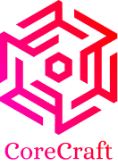

<p align="center">
  
</p>

[](https://github.com/AlexNav73/CoreCraft/actions)
[](https://codecov.io/gh/AlexNav73/CoreCraft)  

## Introduction

`CoreCraft` is a library that simplifies application state management. With automatic code generation, change tracking, and undo/redo support, you can focus on building robust applications without worrying about managing complex state. Additionally, `CoreCraft` provides built-in persistence options, allowing you to easily save and load your application's state to a database or file.

## Main Features

The `CoreCraft` provides a wealth of features, including:

1. **Automatic code generation with Roslyn Source Generators**: `CoreCraft` leverages Roslyn Source Generators by automatically generating all necessary entity classes, changes tracking and persistence based on your schema. This automated process eliminates the necessity of manual coding, saving you time and effort.

1. **Change Tracking and Undo/Redo support**: `CoreCraft` implements change tracking mechanisms, allowing you to monitor the application's state modifications. By tracking changes at a granular level, `CoreCraft` notifies you of specific modifications, enabling you to respond effectively. It provides built-in support for managing and reverting changes, allowing users to undo actions and redo them as needed.

1. **Persistence Options**: `CoreCraft` automatically generates the necessary code to handle persistence (no need to write SQL yourself). It supports saving and loading the application's state to a **SQLite** database and **JSON** files.

1. **Reactive Extensions (Rx.NET) Integration**: `CoreCraft` incorporates Reactive Extensions ([Rx.NET](https://github.com/dotnet/reactive)) to provide a flexible subscription mechanism. It utilizes the `IObservable` and `IObserver` interfaces, allowing you to leverage the power of Rx.NET for event-driven programming and reactive data processing.

## Benefits

- Simplify application state management
- Reduce development time and effort
- Improve data integrity and consistency

## NuGet Packages

CoreCraft is distributed as NuGet packages.

| Package                  |                                                                            Status                                                                             |
| :----------------------- | :-----------------------------------------------------------------------------------------------------------------------------------------------------------: |
| CoreCraft                |                [](https://www.nuget.org/packages/CoreCraft)                |
| CoreCraft.Generators     |     [](https://www.nuget.org/packages/CoreCraft.Generators)     |
| CoreCraft.Storage.SQLite | [](https://www.nuget.org/packages/CoreCraft.Storage.SQLite) |
| CoreCraft.Storage.Json   |   [](https://www.nuget.org/packages/CoreCraft.Storage.Json)   |

## Installation

```
dotnet add package CoreCraft
dotnet add package CoreCraft.Generators
```

## Getting Started

To start using CoreCraft, follow these steps:

1. **Install CoreCraft and CoreCraft.Generators packages**: Run the following command in your terminal or command prompt:

```
dotnet add package CoreCraft
dotnet add package CoreCraft.Generators
```

2. **Create a schema file with extension `.model.json`**: Create a new JSON file with the name `your_schema.model.json` (replace `your_schema` with your desired schema name). This file will define the structure of your application state.

```json
{
  "shards": [
    {
      "name": "ToDo",
      "entities": [
        {
          "name": "ToDoItem",
          "properties": [
            { "name": "Name", "type": "string", "defaultValue": "string.Empty" }
          ]
        }
      ],
      "collections": [{ "name": "Items", "entityType": "ToDoItem" }],
      "relations": []
    }
  ]
}
```

3. **Add the schema file to the csproj project file as `AdditionalFiles`**: Open your `.csproj` file and add the following lines:

```xml
<ItemGroup>
  <AdditionalFiles Include="path\to\your_schema.model.json" />
</ItemGroup>
```

Replace `path\to\your_schema.model.json` with the actual path to your schema file.

4. **Create an instance of the `DomainModel` class and register all generated `ModelShards`**: In your code, create an instance of the `DomainModel` class and register all generated model shards:

```cs
var model = new DomainModel([new ToDoModelShard()]);
```

### Full code example

Here's an full example code snippet that demonstrates how to use the `CoreCraft`:

```cs
// Create an instance of the domain model (application state)
var model = new DomainModel([new ToDoModelShard()]);

// Subscribe to Items collection change events
using var subscription = model.For<IToDoChangesFrame>()
    .With(x => x.Items)
    .Subscribe(OnItemChanged);

// Observe changes
void OnItemChanged(Change<ICollectionChangeSet<ToDoItem, ToDoItemProperties>> changes)
{
    foreach (var c in changes.Hunk)
    {
        Console.WriteLine($"Entity [{c.Entity}] has been {c.Action}ed.");
        Console.WriteLine($"   Old data: {c.OldData}");
        Console.WriteLine($"   New data: {c.NewData}");
    }
}

// Adds new item to the collection
await model.Run<IMutableToDoModelShard>(
    (shard, _) => shard.Items.Add(new () { Name = "test" }));

// Saves model to the SQLite database
var storage = new SqliteStorage("my_data.db", []);
await model.Save(storage);
```

Please refer to the [documentation](https://github.com/AlexNav73/CoreCraft/wiki/Getting-Started) for comprehensive information on using the `CoreCraft` toolkit and its features.

## License

[MIT](LICENSE).
